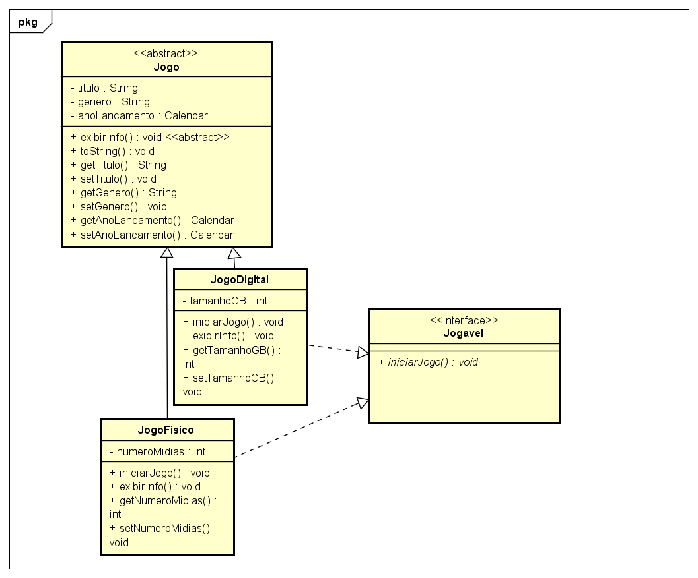

#GameLibrary - Biblioteca de Jogos em Java

Projeto de uma biblioteca de jogos feita em Java.

#Funcionalidades

- Adicionar jogos
- Listar jogos.
- Estoque de jogos

#Diagrama UML

#Tecnologias

- Java
- Orientação a Objetos
- Collections Framework

## 🚀 Como executar

1. Clone o repositório
2. Compile com seu IDE favorito ou via terminal
3. Execute a classe `Main`
